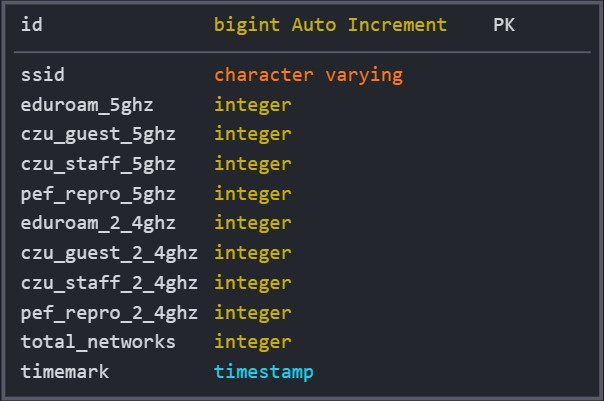
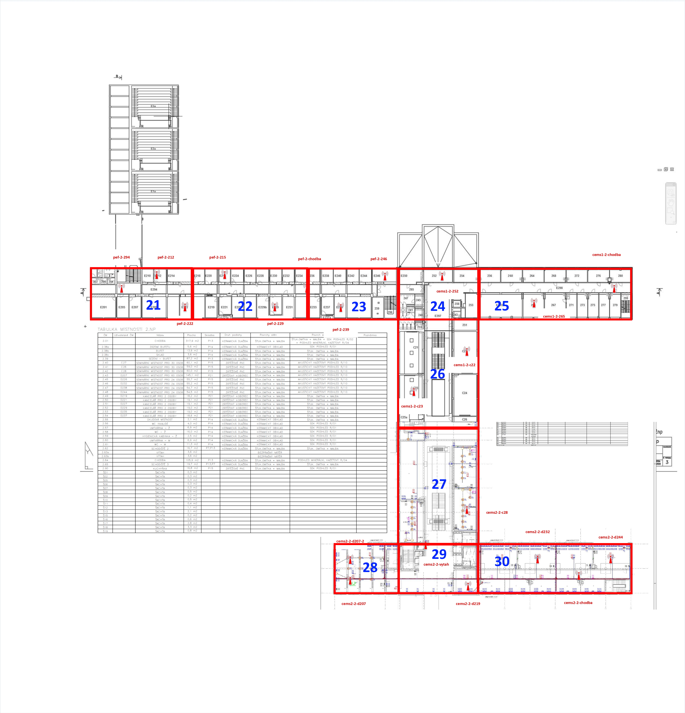
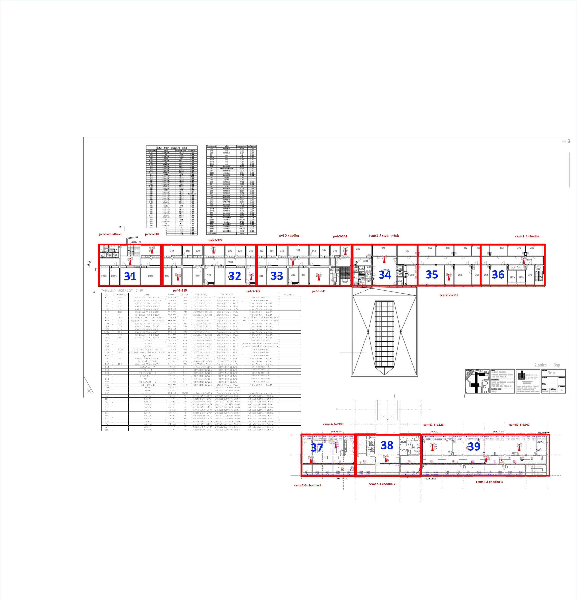
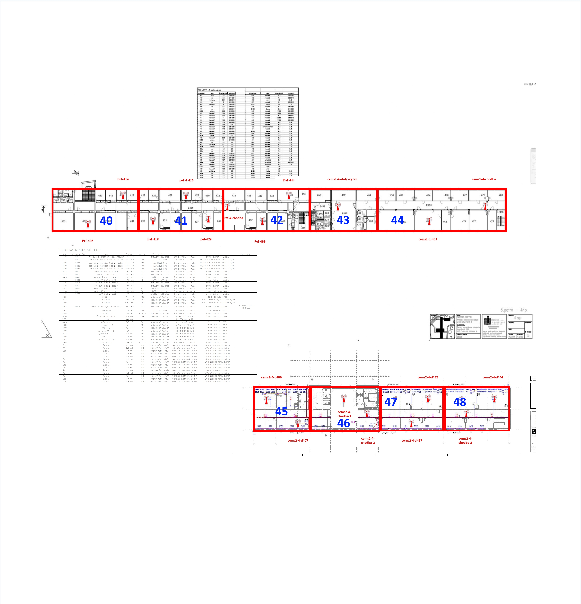
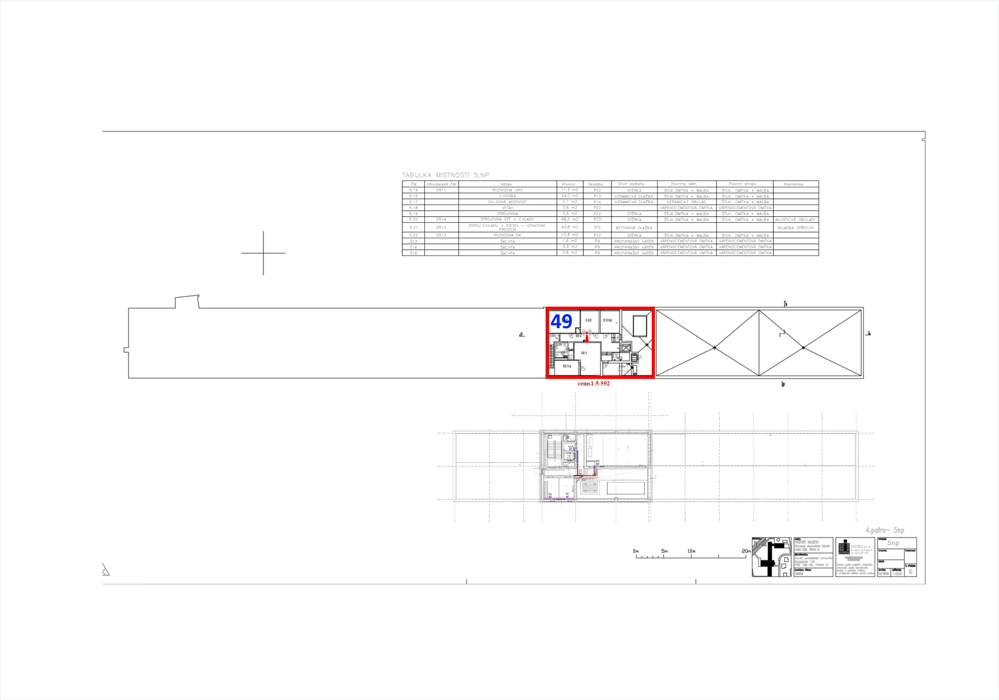

# ČZU Wolno Application WiFi Parser Script


## Content

1. [Introduction](#intro)
2. [Structure description](#structdesc)
3. [Sample data](#howworks)
4. [Database SQL Tables](#DB)
5. [Map of Zones](#zones)

---

## <a id='intro'>Introduction</a>

The purpose of this script is to parse data from WiFi access points every five minutes, then process them and save them to the database for further visualization or analysis.

__[More info about Wolno application](http://ls40.pef.czu.cz/obsazenost-arealu-czu)__

## <a id='structdesc'>Structure description</a>

In the folder ```src/``` we have our entire program.

File ```main.py``` сontains actually script for parsing data from WiFi acces points and saves it to database.

File ```ap_zones.py``` is file for mapping (static mapping) existing acces points to zones we have on map (see images). One zone can include one or more acces points. ID of zones depend on the zone index in the zone list.

```logging_configs.py``` this file is used to configure our logging.

In the folder ```/airflow_dag``` you can find a prepared dag for automation via airflow.

And in the ```/test``` folder you can find the tests of our program.

##### When creating the script, the following modules were used

```python
beautifulsoup4==4.12.2
certifi==2023.7.22
charset-normalizer==3.2.0
idna==3.4
iniconfig==2.0.0
packaging==23.1
pluggy==1.2.0
psycopg2-binary==2.9.7
pytest==7.4.0
pytz==2023.3
requests==2.31.0
soupsieve==2.4.1
urllib3==2.0.4

```

and dependencies that come with them.
___

## <a id='howworks'>Sample data</a>

Example of the data we get after a request

Using acces points names, we can make a request to a specific acces point and get this tamplate of data:

```str
API response structure:
AP_Name (Hostname)
AP_Uptime 
AP_Model
Networks_5G: (str, const)
A
B
C
Networks_2.4G: (str, const)
A
B
C
Pocet_lidi_5G: (str, const)
network_A
network_B
network_C
Pocet_lidi_2.4G: (str, const)
network_A
network_B
network_C
data z controlleru (str, const)
vytvoreni souboru pro dane ap creating: (str, const) timestamp (datetime)
```

___

## <a id='DB'>Database SQL Tables</a>

Data is saved in two tables (`wifi_data`, `wifi_users`) __Name of Tables is subject to change.__

### wifi_data



### wifi_users


___
In table `wifi_data` we save all data. And in table `wifi_users` we save the data that we have previously sorted into specific zones with specific ID by `ap_zones.py`

___

## <a id='zones'>Map of Zones</a>

Each number on the map corresponds to a zone ID in `ap_zones.py`

### 1.Floor


___

### 2.Floor


___

### 3.Floor


___

### 4.Floor


___

### 5.Floor


___
